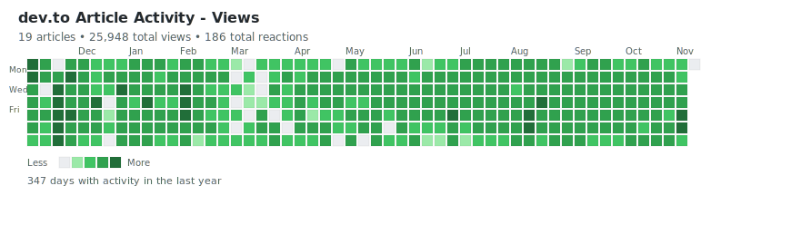
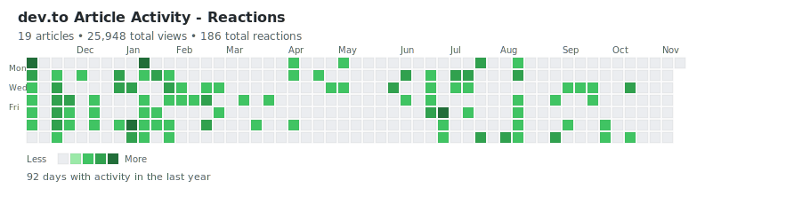
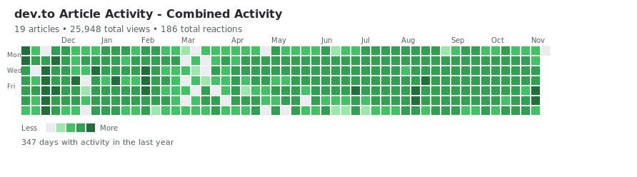
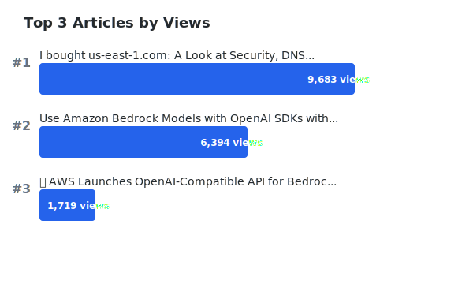
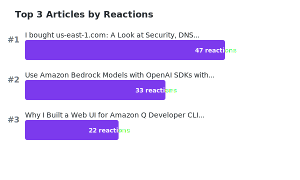

# 📊 dev.to Article Activity Graphs

> 🤖 This entire project was created by [Kiro IDE](https://kiro.dev/) - an AI-powered development environment

GitHub-style contribution graphs for your dev.to article analytics

This repository fetches your article statistics on dev.to weekly via its v1 API and generates beautiful visualizations of your writing activity.

## 🌐 Traffic Sources Analysis
Shows your top referrers with a beautiful pie chart


## 📈 Views Activity
Shows daily article views with GitHub's classic green color scheme



## 💜 Reactions Activity
Shows daily article reactions (likes, unicorns, bookmarks) with purple color scheme



## 🔥 Combined Activity
Shows weighted combined activity (views + comments×5 + reactions×3) with orange color scheme



## 🏆 Top Articles by Views
Shows your top 3 most viewed articles



## ⭐ Top Articles by Reactions
Shows your top 3 most reacted articles



## 🛠 Usage

Generate custom graphs with different metrics and color schemes:

```bash
# Activity graphs (GitHub-style contribution graphs)
python3 generate_advanced_graph.py --metric views --color github
python3 generate_advanced_graph.py --metric reactions --color purple
python3 generate_advanced_graph.py --metric comments --color blue
python3 generate_advanced_graph.py --metric combined --color orange

# Top articles graphs
python3 generate_top_articles.py --metric views --count 3
python3 generate_top_articles.py --metric reactions --count 5

# Traffic sources analysis
python3 generate_traffic_pie_chart.py
python3 generate_traffic_pie_chart.py --count 15  # Show top 15 instead of 10
```

**Activity graph options:**
- `--metric`: views, comments, reactions, combined
- `--color`: github, blue, purple, orange
- `--output`: custom filename
- `--no-stats`: hide statistics

**Top articles options:**
- `--metric`: views, reactions
- `--count`: number of top articles to show (default: 3)
- `--output`: custom filename

**Update data:**
```bash
python3 fetch_stats.py
```

## Data Structure

The application stores data in the following structure:
- `./data/articles/{id}-{slug}.json` - Individual article statistics with referrer data
- `./data/account.json` - Account-wide statistics with aggregated referrer data
- `./data/top_articles.json` - Top performing articles by metrics

Each article file now includes:
- Basic metrics: views, comments, reactions
- Daily breakdown of activity
- **Referrer data**: domains and their traffic counts

## API Endpoints

The application uses the following dev.to API endpoints:
- `/analytics/historical` - Historical analytics data for articles
- `/analytics/referrers` - Referrer data showing traffic sources
- `/articles/me/published` - List of published articles

## Procedures

1. List all published articles of the API key's user
2. For each article,
   - If it has been processed before (i.e. ./data/articles/{id}-{slug}.json exists), locate the last date in "breakdown", use the analytics API to update the `.breakdown` array with new data from the next day.
   - If it has not been processed before, create a new file with the article's ID and slug, and fetch the analytics data to populate the file. Start from the day when the article was published.
   - **Fetch referrer data** using the `/analytics/referrers` endpoint to understand traffic sources
3. Update the `./data/account.json` file with the total statistics and aggregated referrer data of the user.

## Referrer Data

The application now tracks where your article traffic comes from:
- **Direct traffic** (domain: null) - users who visited directly
- **Search engines** - google.com, bing.com, duckduckgo.com
- **Social media** - linkedin.com, twitter (t.co), facebook.com
- **Developer platforms** - dev.to, github.com, substack.com
- **Other sources** - various websites and applications

Use `add_referrers_to_all.py` to add referrer data to existing article files.

## Setup

### Local Setup
1. Copy `.env.example` to `.env` and add your dev.to API key
2. Install required dependencies: `pip install requests`
3. Run `python3 fetch_stats.py` to collect your article data
4. Generate visualizations with the Python scripts above

### Automated Daily Updates (GitHub Actions)

This repository includes a GitHub Actions workflow that automatically updates your stats daily.

**Setup:**
1. Fork this repository
2. Go to your repository's Settings → Secrets and variables → Actions
3. Add a new repository secret:
   - Name: `DEVTO_API_KEY`
   - Value: Your dev.to API key
4. The workflow will run daily at midnight UTC and update your graphs

**Features:**
- Runs daily at midnight UTC to keep your stats current
- Starts from the 2nd last day to refresh potentially incomplete data
- Automatically commits and pushes updated graphs
- Can be manually triggered from the Actions tab

**Manual trigger:**
Go to Actions → "Update Dev.to Stats" → "Run workflow" to update immediately.

---

## 🚀 Get Started

Ready to create your own dev.to analytics visualizations? Check out the complete source code and documentation:

**[📊 devto-stats-github-action](https://github.com/gabrielkoo/devto-stats-github-action)**

Fork the repository, add your dev.to API key, and start generating beautiful GitHub-style contribution grids for your articles!